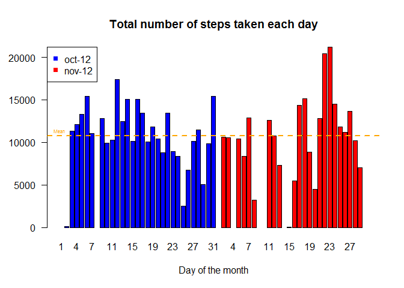
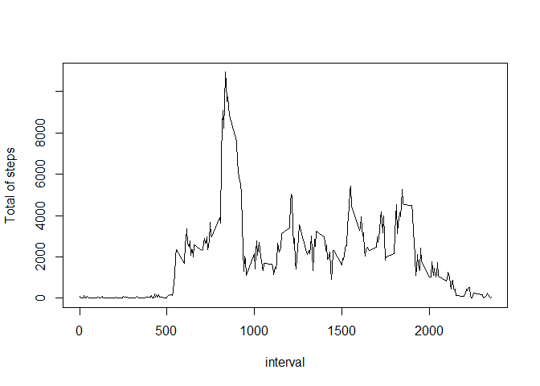
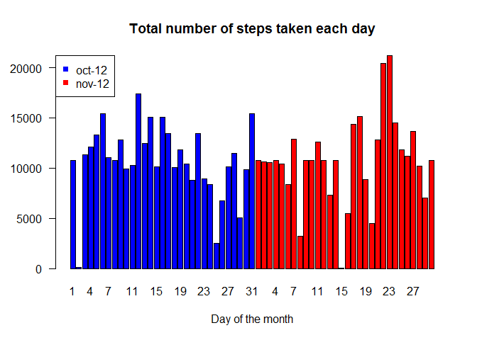
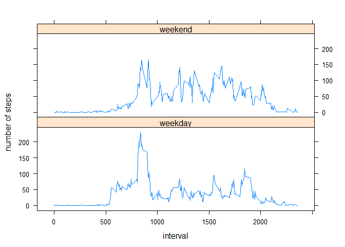

# Reproducible Research: Peer Assessment 1

```r
knitr::opts_chunk$set(fig.path='figure/')
```

## Loading and preprocessing the data
We load the data

```r
library(readr)
library(dplyr)
library(lubridate)
activity <- read_csv("activity.csv",col_types ="iDi")
activity <- tbl_df(activity)
activity
```

```
## Source: local data frame [17,568 x 3]
## 
##    steps       date interval
##    (int)     (date)    (int)
## 1     NA 2012-10-01        0
## 2     NA 2012-10-01        5
## 3     NA 2012-10-01       10
## 4     NA 2012-10-01       15
## 5     NA 2012-10-01       20
## 6     NA 2012-10-01       25
## 7     NA 2012-10-01       30
## 8     NA 2012-10-01       35
## 9     NA 2012-10-01       40
## 10    NA 2012-10-01       45
## ..   ...        ...      ...
```

## What is mean total number of steps taken per day?
### 1. Calculate the total number of steps taken per day

```r
steps.byday <- activity%>% 
        group_by(date)%>%
        summarise(Tsteps=sum(steps))
```

### 2. Make a histogram of the total number of steps taken each day

```r
mean_steps=mean(steps.byday$Tsteps,na.rm = TRUE)
barplot(steps.byday$Tsteps, 
        names.arg = mday(steps.byday$date),
        col=ifelse(month(steps.byday$date)==10,"blue","red"),
        main="Total number of steps taken each day",
        las=1,xlab = "Day of the month")
abline(h=mean_steps,lwd=2, lty=2,col="orange")
legend("topleft", legend = c("oct-12", "nov-12"), 
       pch=15, col=c("blue","red"))
text(.2,mean_steps+600,"Mean",col="orange",cex=.5)
```

<!-- -->

### 3. Calculate and report the mean and median of the total number of steps taken per day

```r
mean_steps=mean(steps.byday$Tsteps,na.rm = TRUE)
median_steps=median(steps.byday$Tsteps,na.rm = TRUE)
c("mean steps"=mean_steps,"median steps"=median_steps ) 
```

```
##   mean steps median steps 
##     10766.19     10765.00
```


## What is the average daily activity pattern?

### 1. Make a time series plot (i.e. type = "l") of the 5-minute interval (x-axis) and the average number of steps taken, averaged across all days (y-axis)


```r
steps.by5minInter <- activity%>% 
        group_by(interval)%>%
        summarise(Tsteps=sum(steps, na.rm=TRUE))
plot(steps.by5minInter,type="l",ylab="Total of steps")
```

<!-- -->

### 2. Which 5-minute interval, on average across all the days in the dataset, contains the maximum number of steps?

```r
interval_maxSteps <-
steps.by5minInter$interval[steps.by5minInter$Tsteps==max(steps.by5minInter$Tsteps)]
c("interval with the maximum steps"=interval_maxSteps)
```

```
## interval with the maximum steps 
##                             835
```


## Imputing missing values
### 1. Calculate and report the total number of missing values in the dataset (i.e. the total number of rows with NAs)

```r
sum(is.na(activity$steps))
```

```
## [1] 2304
```

### 2. Devise a strategy for filling in all of the missing values in the dataset. The strategy does not need to be sophisticated. For example, you could use the mean/median for that day, or the mean for that 5-minute interval, etc.

I will use the mean round to the near integer (round(mean)) per the 5-minute interval for filling the missing values. 

```r
mean_steps.inter <- activity%>% 
        group_by(interval)%>%
        summarise(Msteps=round(mean(steps, na.rm=TRUE)))
```

### 3. Create a new dataset that is equal to the original dataset but with the missing data filled in.

```r
activity.noNA<- merge(activity,mean_steps.inter,by.x="interval",by.y="interval") %>%
        arrange(date,interval) %>%
        mutate(steps=ifelse(is.na(steps),Msteps,steps)) %>%
        select(steps,date, interval)
```

### 4. Make a histogram of the total number of steps taken each day and Calculate and report the mean and median total number of steps taken per day. Do these values differ from the estimates from the first part of the assignment? What is the impact of imputing missing data on the estimates of the total daily number of steps?

```r
steps.byday_noNa <- activity.noNA%>% 
        group_by(date)%>%
        summarise(Tsteps=sum(steps))
barplot(steps.byday_noNa$Tsteps, 
        names.arg = mday(steps.byday_noNa$date),
        col=ifelse(month(steps.byday_noNa$date)==10,"blue","red"),
        main="Total number of steps taken each day",
        las=1,xlab = "Day of the month")
legend("topleft", legend = c("oct-12", "nov-12"), 
       pch=15, col=c("blue","red"))
```

<!-- -->

```r
mean_steps_noNA=mean(steps.byday_noNa$Tsteps,na.rm = TRUE)
median_steps=median(steps.byday_noNa$Tsteps,na.rm = TRUE)
c("mean steps no NA"=mean_steps,"median steps no NA"=median_steps ) 
```

```
##   mean steps no NA median steps no NA 
##           10766.19           10762.00
```

We can observe that there is no impact for considering the NA values. We have the same mean and the porcentual difference of the median is almost zero.  

## Are there differences in activity patterns between weekdays and weekends?

### 1. Create a new factor variable in the dataset with two levels - "weekday" and "weekend" indicating whether a given date is a weekday or weekend day.

```r
activity.noNA$type_day <-
        ifelse(wday(activity$date)>1 & wday(activity$date)<7,1,2)  %>% 
        factor(labels = c("weekday", "weekend")) 
```

### 2. Make a panel plot containing a time series plot (i.e. type = "l") of the 5-minute interval (x-axis) and the average number of steps taken, averaged across all weekday days or weekend days (y-axis). See the README file in the GitHub repository to see an example of what this plot should look like using simulated data.

```r
library(lattice)
averange_steps.typeDay <- activity.noNA%>% 
        group_by(interval,type_day)%>%
        summarise(Msteps=mean(steps))
xyplot(Msteps ~ interval| type_day,data=averange_steps.typeDay,
       type="l",ylab="number of steps", layout=c(1,2))
```

<!-- -->
